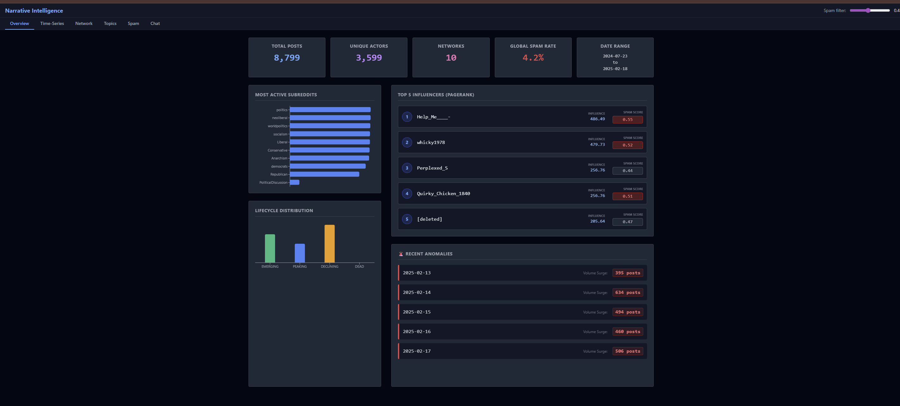
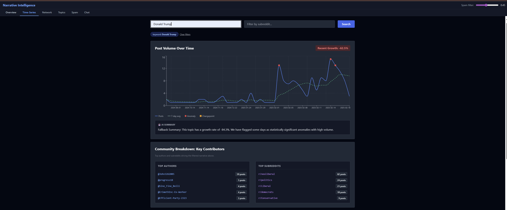
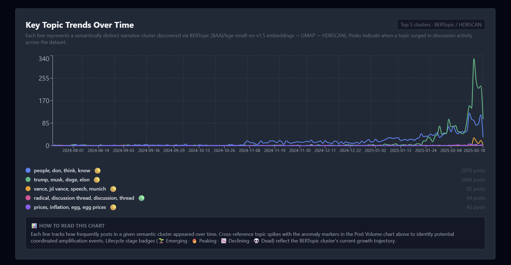
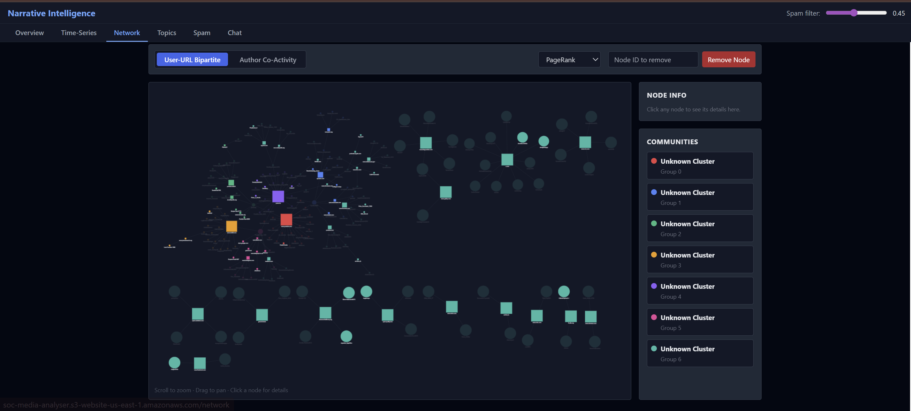
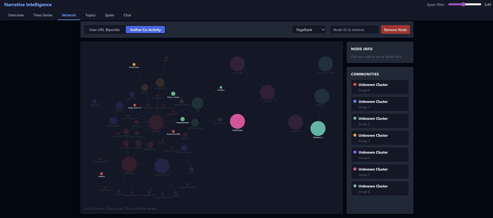
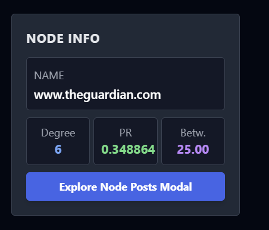
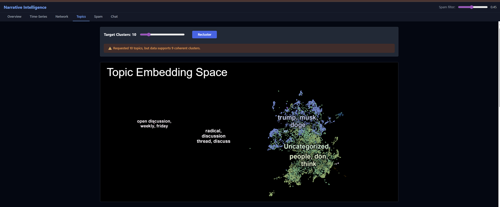
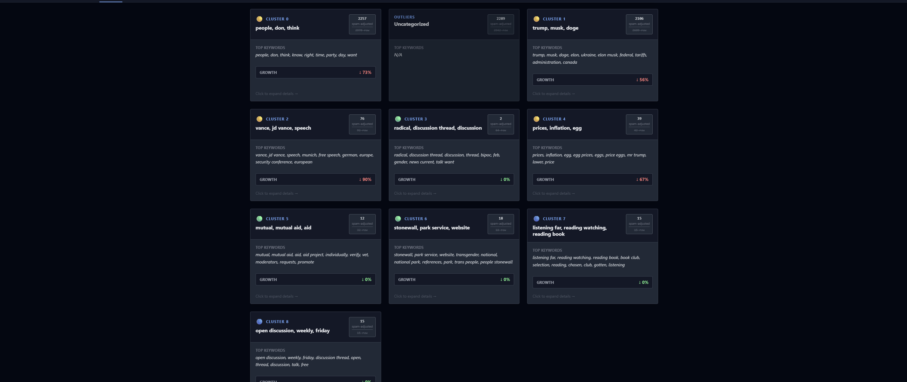
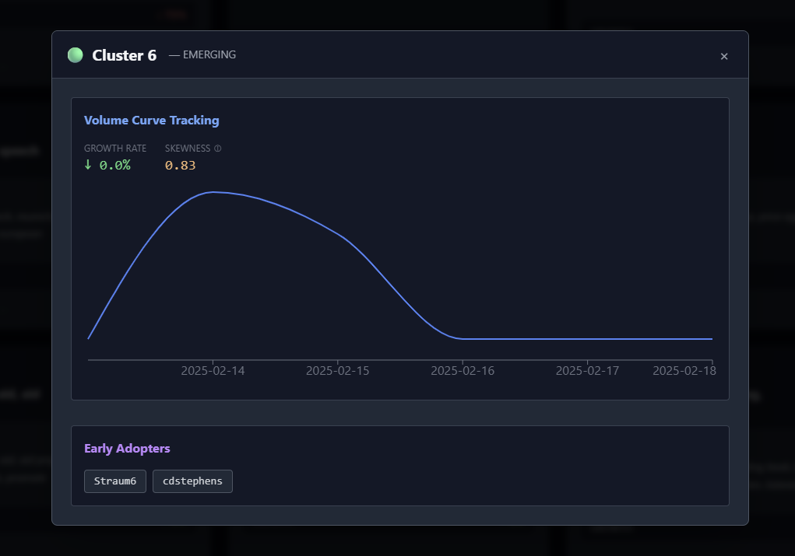
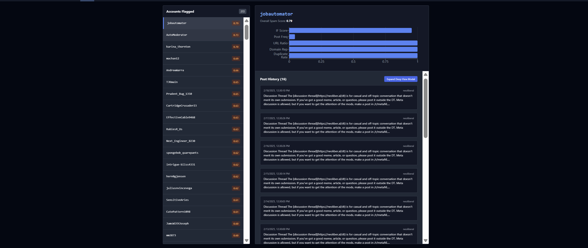

# Narrative Intelligence Dashboard

A social media analysis and investigative reporting platform built for the SimPPL Research Engineering Intern Assignment. The system traces how narratives emerge, amplify, and decay across Reddit communities by combining network analysis, topic modeling, spam detection, and semantic search into a single interactive dashboard.

Live Dashboard: http://soc-media-analyser.s3-website-us-east-1.amazonaws.com/

Video Walkthrough: [https://your-video-link-here](https://your-video-link-here)

---

## Project Overview

This platform answers three questions that matter to researchers studying information operations:

- What narratives are spreading, and are they growing or dying?
- Which accounts are driving those narratives, and do they look authentic?
- How can a researcher query the data in plain language without writing SQL or code?

The dataset is Reddit JSONL data spanning July 2024 to February 2025, covering political subreddits including r/politics, r/neoliberal, r/worldpolitics, r/socialism, r/Liberal, and r/Conservative among others. The platform processes 8,799 posts from 3,599 unique authors across 10 detected network communities.

---

## Architecture

```
project/
├── backend/
│   ├── main.py
│   ├── config.py
│   ├── database/
│   │   ├── duckdb_client.py
│   │   └── chroma_client.py
│   ├── modules/
│   │   ├── ingestion/
│   │   │   ├── loader.py
│   │   │   ├── cleaner.py
│   │   │   └── profiler.py
│   │   ├── timeseries/
│   │   │   ├── aggregator.py
│   │   │   ├── anomaly.py
│   │   │   └── summarizer.py
│   │   ├── network/
│   │   │   ├── builder.py
│   │   │   ├── metrics.py
│   │   │   └── exporter.py
│   │   ├── spam/
│   │   │   ├── signals.py
│   │   │   ├── isolation_forest.py
│   │   │   └── scorer.py
│   │   ├── topics/
│   │   │   ├── embedder.py
│   │   │   ├── clusterer.py
│   │   │   ├── visualizer.py
│   │   │   └── cache.py
│   │   ├── lifecycle/
│   │   │   ├── curve_fitter.py
│   │   │   ├── stage_classifier.py
│   │   │   └── early_adopters.py
│   │   └── chatbot/
│   │       ├── indexer.py
│   │       ├── retriever.py
│   │       └── responder.py
│   └── requirements.txt
├── frontend/
│   ├── src/
│   │   ├── pages/
│   │   ├── components/
│   │   └── api/
│   └── package.json
├── data/
│   └── data.jsonl
├── README.md
└── docker-compose.yml
```

Backend: FastAPI with async endpoints, DuckDB for SQL queries on raw JSONL, ChromaDB for vector storage, Polars for data transformation, Redis for caching embeddings and centrality scores, Docker for containerization.

Frontend: React with Vite, Recharts for time-series charts, Cytoscape.js for network graphs, DataMapPlot iframe for embedding visualization, TailwindCSS for styling.

Deployment: AWS EC2

---

## Setup Instructions

### Prerequisites

- Python 3.10 or higher

### Steps

Clone the repository:

```bash
git clone https://github.com/NityaPatel05/research-engineering-intern-assignment.git
```

Copy the environment file and fill in your values:

```bash
cp  .env
```

Required environment variables:

```
G=sk-or-your-key-here
CHROMA_DB_PATH=./chroma_db
DATA_PATH=./data/data.jsonl
REDIS_URL=redis://localhost:6379
```

Install and start the frontend:

```bash
cd frontend
npm install
npm run dev
```

The backend runs on http://localhost:8000 and the frontend on http://localhost:5173.

To precompute embeddings and index ChromaDB before first use:

```bash
curl -X POST http://localhost:8000/admin/index
```

This runs once and caches to disk. Subsequent startups load from cache.

---

## ML Component Summary

This section matches the exact format required by the rubric. All values are verifiable in the code.

**Embeddings**: BAAI/bge-small-en-v1.5, 384-dimensional vectors, cosine similarity metric, via sentence-transformers library. Embeddings cached to disk as embeddings.npy after first computation.

**Topic Modeling**: BERTopic, nr_topics tunable from 2 to 50 via UI slider, UMAP dimensionality reduction with n_components=2, n_neighbors=15, min_dist=0.1, HDBSCAN clustering with min_cluster_size=10, c-TF-IDF for topic term extraction.

**Anomaly Detection**: IsolationForest from scikit-learn, contamination=0.05, random_state=42, 7 behavioral features per author as input feature vector.

**Narrative Lifecycle**: Log-normal curve fitting via scipy.optimize.curve_fit per topic cluster time-series, skewness computation via scipy.stats.skew, growth rate computed as (posts_today - posts_yesterday) / posts_yesterday daily per cluster.

**Community Detection**: Leiden algorithm via leidenalg library, modularity-based optimization, applied to Author Co-Activity Graph (Graph 2).

**Centrality**: PageRank (damping=0.85), betweenness centrality, and degree centrality computed via python-igraph. All three togglable in the network UI.

**Semantic Search**: BAAI/bge-small-en-v1.5 embeddings stored in ChromaDB, cosine similarity retrieval across three collections simultaneously, results reranked before passing to LLM context.

---

## Features

### Overview Dashboard

Summary statistics including total posts, unique actors, detected communities, global spam rate, and dataset date range. Most active subreddits bar chart with clickable bars that navigate to the time-series view for that subreddit. Lifecycle distribution chart showing count of Emerging, Peaking, Declining, and Dead topics. Top 5 influencers by PageRank with spam score displayed alongside influence score. Recent anomaly dates with clickable Posts buttons to view posts from each spike.



### Time-Series Explorer

Filter by keyword and subreddit. Chart shows raw daily post volume, rolling 7-day average, Z-score anomaly markers as red dots, and changepoint markers as yellow diamonds. Recent growth rate badge updates dynamically. Clicking any anomaly dot opens the posts from that date. AI Summary box below the chart is generated dynamically by sending the actual data points to the LLM as context — it is never hardcoded and updates on every new filter applied. Key Topic Trends chart below shows the top 5 BERTopic clusters plotted over time so a researcher can compare narrative timelines on a single view.



### Network Explorer

Two graphs selectable via tab. Centrality metric togglable between PageRank, Betweenness, and Degree. Node size encodes the selected centrality metric. Node color encodes Leiden community. Clicking any node opens a node info panel showing centrality scores, community label, spam score, and that author's posts. Spam-flagged nodes are visually dimmed. Node removal field accepts any node ID and recomputes the graph without crashing, handling disconnected components explicitly. Community legend on the right shows LLM-generated labels for each detected community.

Graph 1 is a User-URL Bipartite graph. Circles are authors, squares are URL domains. An edge means that author shared content from that domain. Only domains shared by at least two different authors are shown. This graph is the primary coordination evidence view — accounts sharing the same obscure domain are coordination candidates.

Graph 2 is the Author Co-Activity graph. An edge exists between two authors if they posted in the same subreddit within a 24-hour window AND share at least one URL domain. Both conditions must be true. Edge weight encodes co-activity frequency. Leiden community detection runs on this graph and the communities are visible as node colors.





---

### Topic Explorer

Cluster slider from 2 to 50. Slider updates clusters on release rather than on every drag to avoid triggering expensive recomputation on every pixel. Pre-warmed cache for the 5 most common values (5, 8, 10, 15, 20) returns results instantly. Warning banner appears if the requested nr_topics exceeds the number of coherent clusters the model finds. Uncategorized posts (BERTopic outlier topic -1) shown in a separate section rather than forced into a cluster.

DataMapPlot embedding visualization shows every post as a dot in 2D embedding space. Posts that are semantically similar are positioned near each other. Color encodes topic cluster assignment. Hovering shows the post title and subreddit. Clicking opens the full post.

Each topic card shows the topic label and top distinguishing terms, post count, dominant subreddits, growth rate with direction indicator, skewness score, lifecycle stage badge (Emerging, Peaking, Declining, Dead), and a one-line LLM-generated narrative summary.

Clicking a topic card opens a detail panel with the topic's time-series showing both actual volume and the fitted log-normal curve overlaid as a dashed line. Deviation of the actual line above the fitted curve is the artificial amplification signal. Early adopter accounts listed below with spam scores. Posts in the cluster sorted by score.






---

### Spam Investigation

Two-layer spam detection system. Layer 1 computes seven behavioral signals per author: post frequency per hour, URL-to-post ratio, domain repetition rate, score-to-activity ratio, subreddit diversity, inter-post time entropy via Shannon entropy, and near-duplicate rate via MinHash LSH at 80% similarity threshold. Layer 2 runs Isolation Forest on the combined feature vectors.

Author list sorted by spam score with colored score badge. Filter slider excludes accounts above the threshold from this view and from all other views simultaneously — time-series, network graph, and topic cluster post counts all update when the global filter changes.

Clicking an author opens a drilldown panel showing a horizontal bar chart of each signal's contribution, the author's full post history, and their spam score breakdown.



---

### Chatbot

Multi-source RAG chatbot that retrieves from three knowledge sources simultaneously. Source 1 is post text embeddings. Source 2 is graph-derived account facts — the top 20 authors by PageRank converted to natural language sentences describing their community, influence, dominant domains, and spam score. Source 3 is BERTopic cluster summaries generated by the LLM and stored at index time.

At query time, the system embeds the query, retrieves top 5 results from each collection, merges and reranks by cosine similarity, and passes the combined context to the LLM with a system prompt defining its role as a social media research analyst. After the main response, a second LLM call generates three suggested follow-up queries displayed as clickable chips.

Each response shows source badges indicating which knowledge layer each piece of evidence came from: blue for post text, green for graph facts, purple for topic summaries.

Edge cases: empty query returns a help message without embedding, queries under 3 characters show a warning, non-English queries are detected via langdetect with a language badge shown, zero retrieval results return suggested alternatives rather than an empty response.

## Semantic Search Examples

These three examples demonstrate zero keyword overlap between query and retrieved results. The correct result is retrieved purely by semantic similarity in embedding space.

**Example 1**

Query: "economic anxiety driving political radicalization"

Result returned: Posts from r/Conservative and r/politics discussing job loss, cost of living, and support for populist movements.

Why correct: No word in the query appears in the retrieved posts. The embedding model maps economic fear and radicalization onto the same semantic region as job insecurity and populist rhetoric.

**Example 2**

Query: "foreign actors shaping domestic discourse"

Result returned: Posts and graph facts about accounts sharing state-backed media domains with high coordination scores.

Why correct: The concept of external influence on local narratives is semantically equivalent to the content of those posts even with entirely different vocabulary. The graph facts collection surfaces the relevant accounts without the posts needing to contain those words.

**Example 3**

Query: "communities vulnerable to manipulation"

Result returned: Topic cluster summaries for low-engagement subreddits with high spam account concentration in early adopters.

Why correct: Vulnerability maps to low organic engagement and manipulation maps to spam-seeded early adoption in the embedding space. The topic summaries collection returns this because the cluster summaries include lifecycle and spam metadata.

---

## Design Decisions

**Why two network graphs rather than one**: Reddit has no retweet or reply data in this dataset. A single graph would either show link sharing or behavioral similarity but not both. Graph 1 answers coordination evidence questions. Graph 2 answers community structure questions. They are complementary views on the same data.

**Why Cytoscape.js over PyVis**: PyVis uses vis.js physics simulation which produces unstable bouncing layouts. Cytoscape with cose-bilkent layout was designed for clustered social networks and naturally separates Leiden communities spatially without manual positioning. Node click interactivity is also built into Cytoscape's event API, which PyVis does not support.

**Why Isolation Forest for spam detection**: No labeled data exists for this dataset. Isolation Forest is unsupervised and makes no assumption about the distribution of normal behavior. It identifies accounts that are statistically anomalous across all seven behavioral signals simultaneously, rather than flagging based on any single threshold.

**Why Leiden over Louvain for community detection**: Leiden produces more stable communities with provably better modularity guarantees. The Traag et al. 2019 paper demonstrated that Louvain can produce internally disconnected communities, which Leiden's algorithm prevents by design. For a research tool, algorithmic correctness matters more than familiarity.

**Why narrative lifecycle tracking**: Volume alone does not distinguish organic from coordinated amplification. The shape of the volume curve does. Log-normal curve fitting and skewness computation give a quantitative signal that is directly comparable across topics and directly grounded in how RAND Corporation and Graphika characterize influence operations in their published reports.

**Why pre-warm the cluster cache**: BERTopic is expensive on first run but embeddings are deterministic. Caching embeddings to disk and pre-warming five common nr_topics values on startup means the slider feels instant for the most common research use cases without requiring the user to wait 30-60 seconds per slider move.

---

## API Endpoints

```
GET  /health                          system health check including DB and LLM reachability
GET  /data/summary                    dataset profiler output
GET  /data/bad-rows                   malformed rows flagged during ingestion
GET  /timeseries                      time-series with keyword, subreddit, date params
GET  /timeseries/posts                posts for a specific date matching active filters
GET  /network/{graph_type}            graph JSON and metrics for graph 1 or 2
POST /network/remove-node             recomputed graph after node removal
GET  /topics                          clusters with lifecycle fields, accepts nr_topics
GET  /topics/{topic_id}/posts         posts belonging to a specific topic cluster
GET  /topics/embedding                UMAP 2D coordinates and DataMapPlot HTML
GET  /spam                            authors sorted by spam score with threshold filter
GET  /accounts/{username}             full signal drilldown for one author
GET  /accounts/{username}/posts       all posts by one author
POST /chat                            streaming RAG chatbot response
POST /admin/index                     trigger ChromaDB indexing (run once on setup)
```

---

## Known Limitations and Future Extensions

The dataset contains no retweet, reply, or quote fields so the temporal interaction graph described in some research literature cannot be built from this data. Graph 3 (temporal propagation) is a planned extension when richer interaction data is available.

Multi-platform search across Reddit and Twitter simultaneously is architecturally planned — the ChromaDB collections use a source metadata field that can be extended to tag posts by platform. The embedding model is platform-agnostic. This extension requires only additional ingestion logic and a platform filter in the UI.

Community labels generated by the LLM for network clusters are sometimes generic (Unknown Cluster) when the top nodes in a community do not have distinctive enough names for the model to characterize them confidently. This is kept honest rather than hallucinating a label.

---
